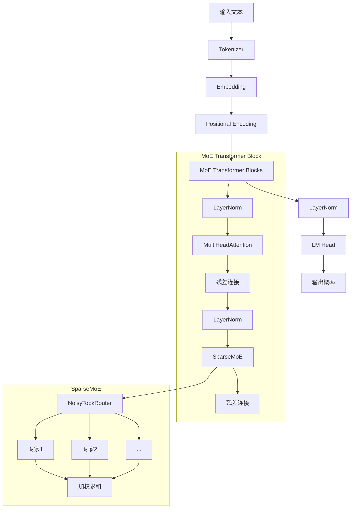

```mermaid
graph TB
    A[输入文本] --> B[Tokenizer]
    B --> C[Embedding]
    C --> D[Positional Encoding]
    D --> E[MoE Transformer Blocks]
    E --> F[LayerNorm]
    F --> G[LM Head]
    G --> H[输出概率]
    
    subgraph MoE Transformer Block
        E --> E1[LayerNorm]
        E1 --> E2[MultiHeadAttention]
        E2 --> E3[残差连接]
        E3 --> E4[LayerNorm]
        E4 --> E5[SparseMoE]
        E5 --> E6[残差连接]
    end
    
    subgraph SparseMoE
        E5 --> E5a[NoisyTopkRouter]
        E5a --> E5b[专家1]
        E5a --> E5c[专家2]
        E5a --> E5d[...]
        E5b --> E5e[加权求和]
        E5c --> E5e
        E5d --> E5e
    end
  
```