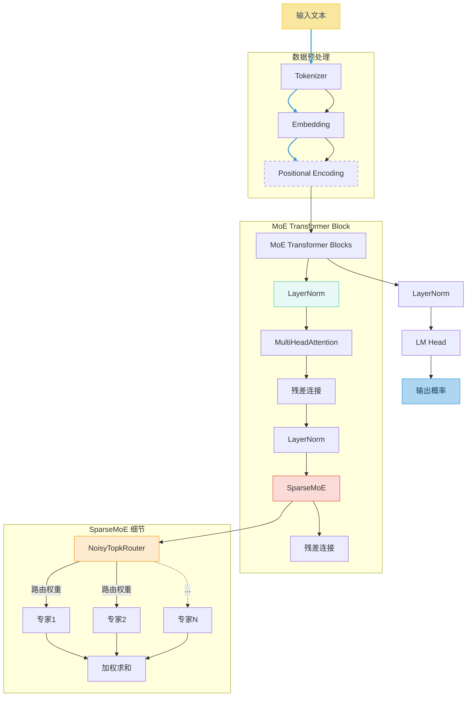

```mermaid
graph TD
    A[输入文本] --> B[Tokenizer]
    B --> C[Embedding]
    C --> D[Positional Encoding]
    D --> E[MoE Transformer Blocks]
    E --> F[LayerNorm]
    F --> G[LM Head]
    G --> H[输出概率]

    style A fill:#F9E79F,stroke:#F1C40F,color:#34495E
    style H fill:#AED6F1,stroke:#3498DB,color:#154360

    subgraph "数据预处理"
        B --> C
        C --> D
        style D stroke-dasharray: 5 5
    end

    subgraph "MoE Transformer Block"
        E --> E1[LayerNorm]
        E1 --> E2[MultiHeadAttention]
        E2 --> E3[残差连接]
        E3 --> E4[LayerNorm]
        E4 --> E5[SparseMoE]
        E5 --> E6[残差连接]
        style E1 fill:#E8F8F5,stroke:#48C9B0
        style E5 fill:#FADBD8,stroke:#E74C3C
    end

    subgraph "SparseMoE 细节"
        E5 --> E5a[NoisyTopkRouter]
        E5a -->|路由权重| E5b[专家1]
        E5a -->|路由权重| E5c[专家2]
        E5a -.->|...| E5d[专家N]
        E5b --> E5e[加权求和]
        E5c --> E5e
        E5d --> E5e
        style E5a fill:#FDEBD0,stroke:#F39C12

        linkStyle 0,1,2 stroke:#3498DB,stroke-width:2px
    end

    click E2 "https://pytorch.org/docs/stable/nn.html#multiheadattention" "PyTorch文档"
    click E5 "javascript:alert('专家数:8\\nTop-K:2')" "MoE参数"
```