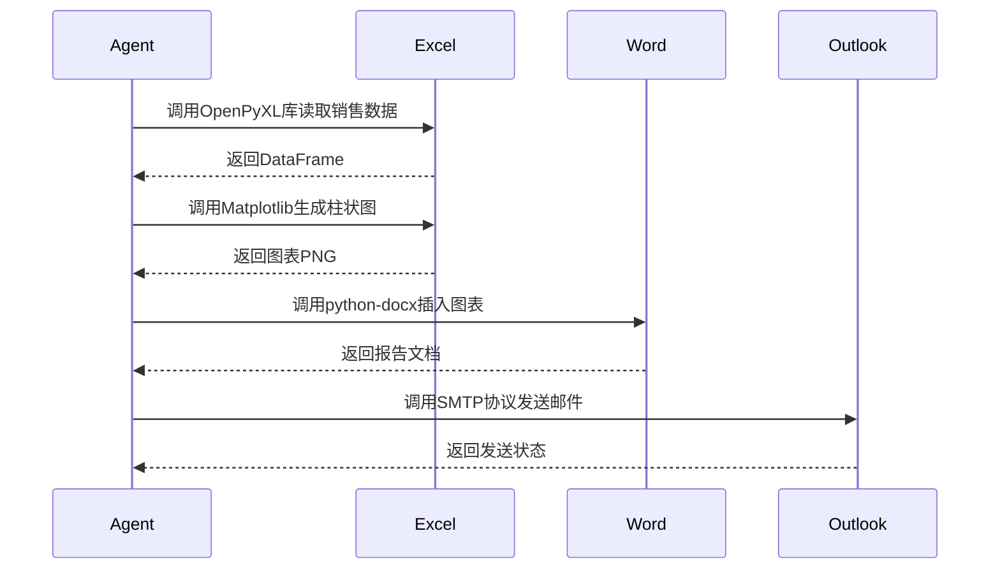

```mermaid
sequenceDiagram  
    participant Agent  
    participant Excel  
    participant Word  
    participant Outlook  
    Agent->>Excel: 调用OpenPyXL库读取销售数据  
    Excel-->>Agent: 返回DataFrame  
    Agent->>Excel: 调用Matplotlib生成柱状图  
    Excel-->>Agent: 返回图表PNG  
    Agent->>Word: 调用python-docx插入图表  
    Word-->>Agent: 返回报告文档  
    Agent->>Outlook: 调用SMTP协议发送邮件  
    Outlook-->>Agent: 返回发送状态  
```