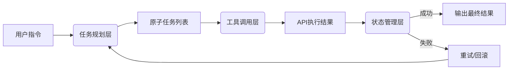

```mermaid
flowchart LR  
    A[用户指令] --> B(任务规划层)  
    B --> C[原子任务列表]  
    C --> D(工具调用层)  
    D --> E[API执行结果]  
    E --> F(状态管理层)  
    F -->|成功| G[输出最终结果]  
    F -->|失败| H[重试/回滚]  
    H --> B  
```