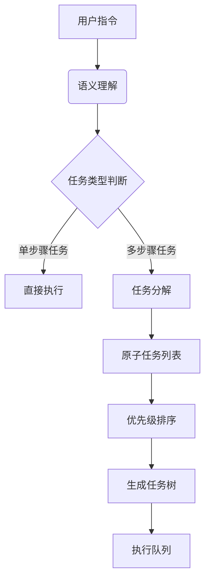

```mermaid
graph TD  
    A[用户指令] --> B(语义理解)  
    B --> C{任务类型判断}  
    C -->|单步骤任务| D[直接执行]  
    C -->|多步骤任务| E[任务分解]  
    E --> F[原子任务列表]  
    F --> G[优先级排序]  
    G --> H[生成任务树]  
    H --> I[执行队列]  
  
```