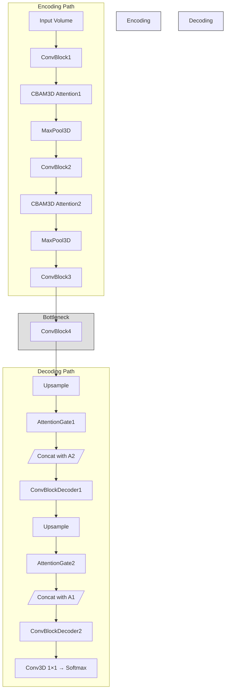

```mermaid
graph TD
    subgraph Encoding Path
        V[Input Volume] --> C1[ConvBlock1]
        C1 --> A1[CBAM3D Attention1]
        A1 --> P1[MaxPool3D]
        P1 --> C2[ConvBlock2]
        C2 --> A2[CBAM3D Attention2]
        A2 --> P2[MaxPool3D]
        P2 --> C3[ConvBlock3]
    end

    subgraph Bottleneck
        C3 --> Bn[ConvBlock4]
    end

    subgraph Decoding Path
        Bn --> U1[Upsample]
        U1 --> AG1[AttentionGate1]
        AG1 --> Concat1[/Concat with A2/]
        Concat1 --> D1[ConvBlockDecoder1]

        D1 --> U2[Upsample]
        U2 --> AG2[AttentionGate2]
        AG2 --> Concat2[/Concat with A1/]
        Concat2 --> D2[ConvBlockDecoder2]

        D2 --> Out[Conv3D 1×1 → Softmax]
    end

    style Encoding Path fill:#EFEFEF,stroke:#333,stroke-width:1px
    style Bottleneck fill:#DFDFDF,stroke:#333,stroke-width:1px
    style Decoding Path fill:#EFEFEF,stroke:#333,stroke-width:1px

  
```