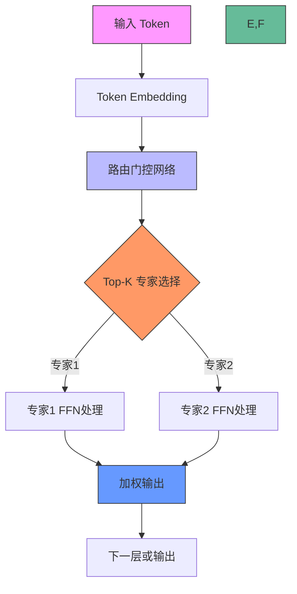

```mermaid
graph TD
    A[输入 Token] --> B[Token Embedding]
    B --> C[路由门控网络]
    C --> D{Top-K 专家选择}
    D -->|专家1| E[专家1 FFN处理]
    D -->|专家2| F[专家2 FFN处理]
    E --> G[加权输出]
    F --> G
    G --> H[下一层或输出]

    style A fill:#f9f,stroke:#333
    style C fill:#bbf,stroke:#333
    style D fill:#f96,stroke:#333
    style E,F fill:#6b9,stroke:#333
    style G fill:#69f,stroke:#333
  
```